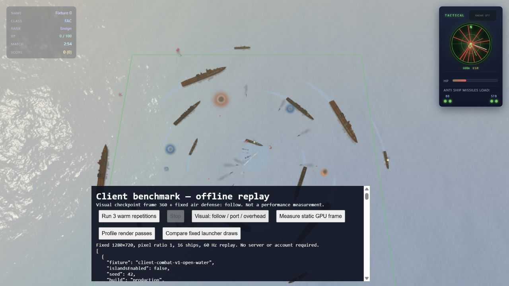

# Starre Werfer: weniger PBR-Zeichenaufrufe

Stand: 27.09.2026. Gameplay, Effekt-Culling, Standardkamera, Assets und Shader-
Qualität bleiben unverändert. Der Langzeittest wurde bewusst nicht durchgeführt.

## Gemessener Ansatzpunkt

Die instrumentierte statische Gefechtsszene zeigte je 110 PBR-Zeichenaufrufe
für Hauptbild und Wasserreflexion. Gemessene CPU-Aufrufzeit dieser Gruppen:
2,11 ms Hauptbild und 3,11 ms Reflexion, gegenüber 0,80 ms Median für die
Szenen-Matrixupdates. Gesamt-Renderaufruf p50/p95 8,7/10,5 ms.
Die Instrumentierung hat eigenen Overhead; diese Werte sind keine GPU-Zeiten.

Identische starre Werfer am selben Schiff werden nun mit `InstancedMesh`
gebündelt. Ihre Instanzmatrizen entstehen einmal beim Anbau; Schiffsbewegung
erfordert keinen neuen Instanzpuffer-Upload. Rumpf und drehende Türme bleiben
unverändert. Die bestehenden Knoten bleiben als nicht zeichnende Transform-
Quellen erhalten, damit Mündungsmarker, Namen und Weltkoordinaten weiter gelten.

Materialien sind nur innerhalb eines Schiffs geteilt, niemals zwischen Schiffen.
Damit bleiben individuelle Spawn-Schutz-/Wrackzustände unabhängig. Geometrie
und Texturen gehören weiterhin dem Asset-Cache; beim Entfernen eines Schiffs
werden die eigenen Instanzpuffer und Materialien genau einmal freigegeben.

Transparente, skinnierte, morphende oder negativ geskalierte Kandidaten werden
nicht gebündelt. Verschiedene Geometrien, Materialien, Render-Reihenfolgen oder
Layer werden nicht zusammengefasst. Die Gruppierung betrifft ausschließlich
als starr eingebaute Werfer, nicht die Effekte oder deren Culling-Regeln.

## Direkter A/B-Nachweis

Produktions-Diagnosebuild `main-CoWIHICI.js`, 1280×720, DPR 1, 16 Schiffe,
aktueller Content, keine Inseln. Eine identische eingefrorene Szene wird abwechselnd
mit separaten und instanzierten Werfer-Draws gerendert: je 20 Warmup- und 120
Messframes. Der Referenzpfad bildet auch die frühere Materialtrennung je Werfer
nach; seine kurzlebigen Materialien werden danach freigegeben.

| Kamera / Lauf | Draw Calls alt → neu | CPU p50 alt → neu | CPU p95 alt → neu |
| --- | ---: | ---: | ---: |
| Standard-Folgekamera 1 | 279 → 249 | 5,0 → 4,8 ms | 7,0 → 7,3 ms |
| Schräg | 193 → 177 | 3,7 → 3,0 ms | 6,0 → 6,0 ms |
| Senkrechte Draufsicht | 252 → 229 | 4,0 → 4,0 ms | 6,5 → 6,7 ms |
| Standard-Folgekamera 2 | 279 → 249 | 4,3 → 3,8 ms | 6,6 → 6,6 ms |

In der Standardansicht rund **11 % weniger Draw Calls**. Die CPU-Mediane sind
teilweise besser, die p95-Werte ungefähr gleich: kein pauschales FPS- oder
GPU-Speedup-Versprechen. Ein früher Diagnoseversuch teilte bereits Materialien
im Referenzpfad und wird nicht als vollständiger Alt-/Neu-Vergleich gewertet.

RGB-Vergleich auf 0–255-Skala: mittlere absolute Abweichung 0,000036 (Standard),
0,000009 (schräg), 0,000035 (senkrecht); maximal 9/10/13 an einzelnen Pixeln.
Anteil der Kanäle mit Abweichung >2: jeweils unter 0,0006 %. Kein Anspruch auf
Bitidentität; sehr kleine Rasterisierungsunterschiede durch Instanztransformationen.

In Standard-/Schrägansicht bleibt die Dreieckszahl identisch. Senkrecht werden
276.894 statt 274.086 Dreiecke eingereicht: die gemeinsame Instanz-Bounding-Sphere
ist konservativer als zwei getrennte Bounds am Frustum-Rand. Sichtbare Geometrie
wird weiterhin korrekt geclippt. Das ist ein kleiner dokumentierter Trade-off
gegen weniger Draw Calls, keine Änderung des Effekt-Cullings.

## Tests und Diagnose

### Vollständiges animiertes Replay

Drei Produktionsläufe mit jeweils 300 Warmup- und 1800 Messframes, gleicher
Open-Water-Fixture und Auflösung wie im [vorigen Bericht](INTEGRATED-PERFORMANCE.md):

| Messung | Lauf 1 | Lauf 2 | Lauf 3 |
| --- | ---: | ---: | ---: |
| Render-CPU p50 / p95, ms | 6,1 / 8,9 | 6,4 / 8,5 | 6,4 / 8,5 |
| Frameabstand p50 / p95, ms | 17,5 / 18,1 | 17,5 / 18,2 | 17,5 / 18,1 |
| Draw Calls p50 / p95 | 233 / 235 | 233 / 235 | 233 / 235 |
| Frames >50 ms | 1 | 0 | 0 |

Vorher: Render-CPU p50 7,7–8,1 ms, p95 10,1–10,4 ms und Draw Calls
265 / 267. Das sind rund **12 % weniger Zeichenaufrufe** im gesamten Replay.
Die CPU-Zeiten stammen aus zeitlich getrennten Messreihen; der direkte A/B-Test
oben ist der stärkere Nachweis für den isolierten Effekt. Kein FPS-Versprechen.
Dreiecke bleiben bei p50 312.410 / p95 316.282, aktive Partikel bei 954 / 959.
Alle Läufe haben identische 660 Input-Aufrufe, 700 HUD-Updates und 16 Todesfälle.

Ein ungeklärter Frameabstand von **396,4 ms** im ersten Lauf wird nicht verworfen.
Die gemessenen Render-/Runtime-Zeiten erklären ihn nicht. In beiden Folgeläufen
trat er nicht erneut auf (Maxima 19,3 / 18,7 ms). Das ist kein Nachweis der Ursache
oder Langzeitstabilität; beim späteren Langzeittest auf solche Pausen achten.

Während des Replays: 709 Szenenknoten, 59 Geometrien, 21 Texturen und 16 Programme
an den Vergleichspunkten Frame 300/2040. Gegenüber vorher kommen 16 Batch-Knoten
und zwei Instancing-Shaderprogramme hinzu. Nach jedem Replay unverändert
10 Knoten, 18 Geometrien, 17 Texturen und 4 Programme. Heap-Werte schwanken mit
der Garbage Collection und begründen hier keine Leak-Freiheitsbehauptung.

Drei separate statische GPU-Proben (je 60 Warmup / 120 Samples): p50
4,155 / 4,640 / 4,397 ms; p95 6,162 / 6,672 / 6,506 ms. Vorher p50 etwa 5,2 ms,
p95 6,5–6,7 ms. Kein erkennbarer Regressionshinweis, aber keine zeitgleiche
GPU-A/B-Messung und keine GPU-Zeit des gesamten animierten Replays.

### Abschlussprüfung

Bestanden: `npm test` (61 Client-, 28 Server-, 40 Shared-Testdateien),
`npm run typecheck`, Produktionsbuild und separater Benchmark-Build.
Die bekannte Vite-Warnung zu Chunks über 500 kB bleibt bestehen.
Die neue Kampf-Referenz besteht drei reguläre Prüfläufe mit identischem Trace.
Browserkonsole: keine Warnungen oder Fehler bei der Abnahme.

Sicherheitsprüfung nach `security-inspector`, begrenzt auf diese Änderungen:
keine kritischen oder mit hoher Sicherheit belegten Sicherheitsbefunde.
Keine neuen produktiven Netzwerk-/Admin-Schnittstellen oder Zugangsdaten;
Benchmark-Dateizugriffe bleiben lokal auf Repository-Daten und den eigens
erzeugten temporären Datenordner beschränkt. Diagnosemodule sind nicht im
normalen Produktionsbundle enthalten (Build-Eingänge und Ausgabesuche geprüft).
Das ersetzt weder ein vollständiges Deployment-Audit noch den vertagten Langzeittest.

`staticMountInstances.test.ts` prüft Weltmatrizen und Mündungspositionen,
Material-Isolation zwischen Schiffen, unveränderte Puffer bei Schiffsbewegung,
Ausnahmen für Transparenz/Spiegelung und GPU-Ressourcenfreigabe. Die vorhandenen
Modell-/Mündungs-, Lebenszustands- und Replay-Tests prüfen den integrierten Pfad.

`/benchmark.html?islands=0` bietet zusätzlich „Profile render passes“ und
„Compare fixed launcher draws“ (Kameras reihum). Diese Messwerkzeuge sind nur
im separaten Diagnosebuild enthalten. Die beiden Renderpfade des A/B-Werkzeugs
sind kein Laufzeit-Schalter im Spiel.
